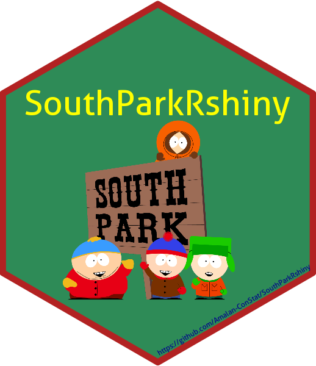

```{r setup, include=FALSE}
knitr::opts_chunk$set(echo = TRUE, message = FALSE, warning = FALSE)
```

<!-- README.md is generated from README.Rmd. Please edit that file -->

# SouthParkRshiny 

<!-- badges: start -->

[](https://cran.r-project.org/package=SouthParkRshiny)
[](https://github.com/Amalan-ConStat/SouthParkRshiny)
[](LICENSE)

[](https://cran.r-project.org/package=SouthParkRshiny)
[](https://cran.r-project.org/package=SouthParkRshiny)
[](https://cran.r-project.org/package=SouthParkRshiny)

[](https://www.repostatus.org/#active)
[](https://lifecycle.r-lib.org/articles/stages.html#stable)
[](https://github.com/Amalan-ConStat/SouthParkRshiny/issues)
[](https://github.com/Amalan-ConStat/SouthParkRshiny)

<!-- badges: end -->

SouthParkRshiny provides data and a Shiny application for exploring
*South Park*. Built using **golem**, the application brings together
episode ratings, vote counts, dialogue, profanity, sentiment and
character networks.

## Installation

Install the released version from CRAN:

```{r install-cran, eval=FALSE}
install.packages("SouthParkRshiny")
```

Alternatively, install the development version from GitHub:

```{r install-github, eval=FALSE}
# install.packages("remotes")
remotes::install_github("Amalan-ConStat/SouthParkRshiny")
```

## Run the application

```{r run-app, eval=FALSE}
SouthParkRshiny::run_app()
```

## What does the application show?

- **Basic information:** summaries of seasons, episodes, characters,
  dialogue and profanity.
- **Ratings and votes:** episode ratings and vote counts, highlighting
  the highest and lowest values within each season.
- **Sentiment analysis:** comparisons using the Bing, NRC and Loughran
  dictionaries, including seasonal summaries and character heatmaps.
- **Special phrases:** frequently used three-word and four-word phrases.
- **Speaking transitions:** directed networks showing which characters
  speak immediately after others.
- **Episode co-occurrence:** networks showing how frequently characters
  have dialogue in the same episodes, measured using Jaccard similarity.

Character analyses include Cartman, Stan, Kyle and Kenny, alongside
selected supporting characters: Liane, Randy, Sharon, Gerald, Sheila
and Mr. Garrison.

Sentiment results describe dictionary word matches. Speaking transitions
and episode co-occurrence describe transcript patterns and do not
necessarily indicate direct interaction between characters.

## Data sources

- Dialogue transcripts are collected from the
  [South Park Archives](https://southpark.fandom.com/wiki/South_Park_Archives).
- Episode information, ratings and vote counts are collected from IMDb.

## Earlier application

The earlier version is available in the
[SouthPark-Rshiny repository](https://github.com/Amalan-ConStat/SouthPark-Rshiny).

## Issues and suggestions

Report bugs or suggest improvements through
[GitHub Issues](https://github.com/Amalan-ConStat/SouthParkRshiny/issues).

## License

This package is distributed under the MIT license.
