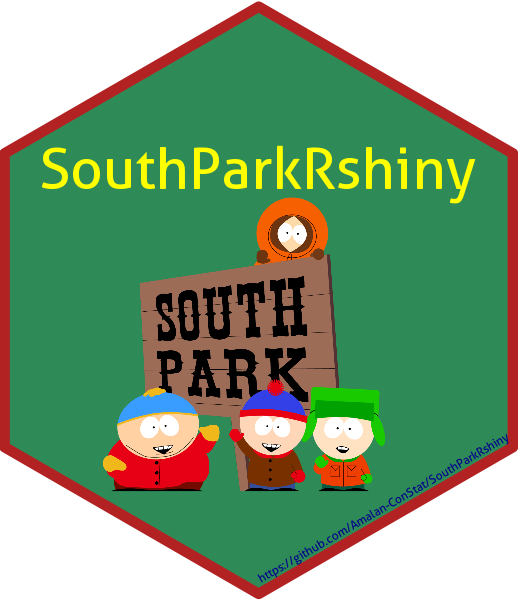

<!-- README.md is generated from README.Rmd. Please edit that file -->

# SouthParkRshiny 

<!-- badges: start -->

[](https://cran.r-project.org/package=SouthParkRshiny)
[](commits/main)
[](https://cran.r-project.org/package=SouthParkRshiny)
[](https://lbesson.mit-license.org/)

[](https://cran.r-project.org/package=SouthParkRshiny)
[](https://cran.r-project.org/package=SouthParkRshiny)
[](https://cran.r-project.org/package=SouthParkRshiny)

[](https://www.repostatus.org/#active)
[](https://lifecycle.r-lib.org/articles/stages.html#stable)
[](https://github.com/Amalan-ConStat/SouthParkRshiny/issues)

[](https://github.com/Amalan-ConStat/SouthParkRshiny)
<!-- badges: end -->

## How to engage with “SouthParkRshiny” the first time ?

``` r
## Installing the package from GitHub
devtools::install_github("Amalan-ConStat/SouthParkRshiny")

## Installing the package from CRAN
install.packages("SouthParkRshiny")
```

Old SouthPark Rshiny application :
[Here](https://github.com/Amalan-ConStat/SouthPark-Rshiny)

## What does this Rshiny App does ?

- Script data of the tv show “SouthPark” is webscraped from
  “<https://southpark.fandom.com/wiki/South_Park_Archives>”.
- Ratings and votes for the show are scraped from “IMDB” as per its
  instructions.
- Analysis on ratings, votes, swear words and sentiments are summarised
  through plots.
